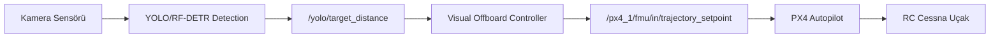
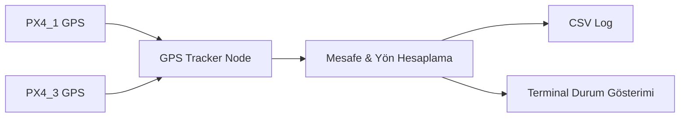

# Sistem Mimarisi

## Genel Bakış

DogFight sistemi, PX4 Autopilot üzerinde çalışan RC sabit kanat uçakları otonom olarak kontrol etmek ve rakip araçları takip etmek için tasarlanmış bir ROS 2 tabanlı yazılım mimarisidir.

## Katmanlı Mimari

```
┌─────────────────────────────────────────────────────────┐
│                    Uygulama Katmanı                      │
│  ┌──────────┐ ┌──────────┐ ┌──────────┐ ┌────────────┐ │
│  │ Detection │ │ Tracking │ │ Control  │ │  Bringup   │ │
│  │ Package   │ │ Package  │ │ Package  │ │  Package   │ │
│  └────┬──────┘ └────┬─────┘ └────┬─────┘ └─────┬──────┘ │
├───────┼─────────────┼────────────┼──────────────┼────────┤
│       │       ROS 2 Middleware (DDS)            │        │
├───────┼─────────────┼────────────┼──────────────┼────────┤
│       ▼             ▼            ▼              ▼        │
│  ┌──────────────────────────────────────────────────┐    │
│  │              px4_msgs + px4_ros_com               │    │
│  └───────────────────────┬──────────────────────────┘    │
├──────────────────────────┼───────────────────────────────┤
│                          ▼                               │
│  ┌──────────────────────────────────────────────────┐    │
│  │          Micro XRCE-DDS Agent (UDP)               │    │
│  └───────────────────────┬──────────────────────────┘    │
├──────────────────────────┼───────────────────────────────┤
│                          ▼                               │
│  ┌──────────────────────────────────────────────────┐    │
│  │              PX4 Autopilot (SITL/HW)              │    │
│  └───────────────────────┬──────────────────────────┘    │
├──────────────────────────┼───────────────────────────────┤
│                          ▼                               │
│  ┌──────────────────────────────────────────────────┐    │
│  │         Gazebo Harmonic / Gerçek Donanım           │    │
│  └──────────────────────────────────────────────────┘    │
└─────────────────────────────────────────────────────────┘
```

## Veri Akışı

### Tespit → Takip → Kontrol Pipeline



### GPS Takip Pipeline



## Paket Sorumlulukları

| Paket | Sorumluluk | Bağımlılıklar |
|-------|-----------|---------------|
| `dogfight_detection` | Kamera görüntüsünden nesne tespiti | rclpy, cv_bridge, sensor_msgs, geometry_msgs |
| `dogfight_tracking` | Hedef konum takibi (GPS/görsel) | rclpy, px4_msgs, geometry_msgs |
| `dogfight_control` | Offboard uçuş kontrolü | rclpy, px4_msgs, geometry_msgs |
| `dogfight_bringup` | Launch dosyaları, konfigürasyon | Tüm dogfight_* paketleri |

## Kontrol Stratejileri

### 1. Attitude Setpoint (attitude_controller_node)
- **Giriş**: Hedef GPS konumu
- **Hesaplama**: Yaw PID → Roll, Altitude PID → Pitch, Distance PID → Thrust
- **Çıkış**: `VehicleAttitudeSetpoint` (quaternion)

### 2. Velocity Setpoint (velocity_controller_node)
- **Giriş**: Offboard komutları
- **Çıkış**: `TrajectorySetpoint` (velocity vektörü)

### 3. Position Setpoint (position_controller_node)
- **Giriş**: PX4_2 lokal pozisyonu
- **Çıkış**: `TrajectorySetpoint` (hedef pozisyon)

### 4. Visual Offboard (visual_offboard_node)
- **Giriş**: `/yolo/target_distance` (piksel sapması)
- **Hesaplama**: Oransal kontrol (P) → velocity vektörü
- **Çıkış**: `TrajectorySetpoint` (velocity)
