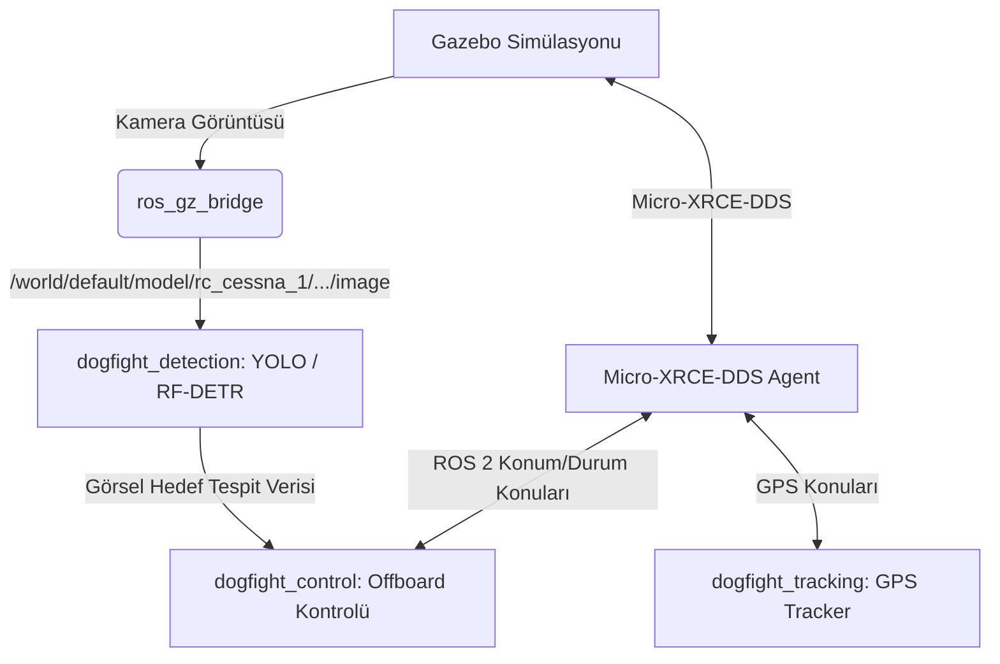

Bu rehber, DogFight simülasyon ortamının nasıl başlatılacağını ve ROS 2 tabanlı otonom takip kontrol düğümlerinin nasıl devreye alınacağını adım adım açıklamaktadır.

---

## 🏗️ Genel Çalışma Mimarisi

Sistem, Gazebo simülasyonundaki 3 adet RC Cessna uçağı ve bu araçların ROS 2 ortamındaki kontrol düğümlerinin haberleşmesi üzerine kuruludur:



---

## 1. Simülasyonun Başlatılması

Simülasyon başlatıcı scripti, Gazebo Harmonic ortamını kurar, 3 uçağı pistte konumlandırır ve kamera görüntüsünü ROS 2'ye aktaran köprüyü otomatik başlatır.

```bash
# Simülasyon scriptini çalıştırın
cd DogFight
bash simulation/scripts/launch_multi_aircraft.sh
```

**Bu script arka planda şunları çalıştırır:**
1. **Gazebo Simülatörü:** `iris_runway` haritasında simülasyonu başlatır.
2. **ROS 2 Gazebo Bridge (`ros_gz_bridge`):** HERO uçağının kamerasına ait `/world/default/model/rc_cessna_1/link/camera_link/sensor/camera/image` konusunu ROS 2 ortamındaki aynı isimli konuya aktarır.
3. **3 adet PX4 SITL Instance'ı:**
   - **HERO (Bizim Uçak):** Instance 1 (`/px4_1` namespace, QGC UDP Port: `14541`)
   - **ENEMY1 (Rakip 1):** Instance 2 (`/px4_2` namespace, QGC UDP Port: `14542`)
   - **ENEMY2 (Rakip 2):** Instance 3 (`/px4_3` namespace, QGC UDP Port: `14543`)

---

## 2. QGroundControl (QGC) Bağlantısı

Uçakları havada izlemek, manuel kalkış komutları vermek ve otonom moda geçirmek için QGroundControl kullanılmalıdır.

1. **QGroundControl uygulamasını açın.**
2. **Comm Links Ayarları:**
   - QGC içinde sağ üstteki dişli simgesine (Application Settings) tıklayın ve **Comm Links** sekmesine gidin.
   - Her uçak için sırasıyla 3 adet UDP bağlantısı ekleyin:
     * **Link 1 (HERO):** Port `14541` (Local Port)
     * **Link 2 (ENEMY1):** Port `14542` (Local Port)
     * **Link 3 (ENEMY2):** Port `14543` (Local Port)
   - Her bağlantı için "Automatically Connect" kutucuğunu işaretleyin ve **Connect** butonuna basın.
3. Bağlantılar sağlandığında QGC üst barında araçlar arasında geçiş yapabileceğiniz bir menü belirecektir.

---

## 3. Micro-XRCE-DDS Agent Başlatılması

PX4 ile ROS 2 düğümlerinin haberleşebilmesi için DDS ajanı çalıştırılmalıdır.

```bash
# Yeni bir terminal açın
MicroXRCEDDSAgent udp4 -p 8888
```

Bu ajan çalışmaya başladığında, simülasyondaki uçaklar DDS konularını ROS 2 ortamına aktaracaktır. `ros2 topic list` yazarak `/px4_1/fmu/...`, `/px4_2/fmu/...` ve `/px4_3/fmu/...` konularının geldiğini doğrulayabilirsiniz.

---

## 4. ROS 2 Workspace Derleme ve Sourcing

Kontrol ve takip düğümlerini çalıştırmadan önce ROS 2 workspace'i derlenmeli ve source edilmelidir.

```bash
# Yeni bir terminalde workspace dizinine gidin
cd DogFight/ros2_ws

# Derleme yapın
colcon build --symlink-install

# Workspace'i source edin
source install/setup.bash
```

---

## 5. Algılama ve Takip Düğümlerinin Çalıştırılması

Tüm sistemlerin entegre çalışabilmesi için `dogfight_bringup` içindeki launch dosyası kullanılır. Bu dosya yapay zeka tabanlı tespit modelini, GPS takip düğümünü ve otonom takip kontrolcü düğümlerini eşzamanlı başlatır.

```bash
# Derlenmiş ve source edilmiş terminalde launch dosyasını çalıştırın
ros2 launch dogfight_bringup dogfight_simulation.launch.py
```

Bu işlem başladığında:
1. **YOLO veya RF-DETR:** Gazebo'dan köprülenen görüntü üzerinde rakip uçağı aramaya başlar.
2. **GPS Tracker:** HERO (`/px4_1`) ile Rakip (`/px4_3`) arasındaki mesafeyi takip edip CSV dosyasına loglar.
3. **Offboard Controller:** Offboard setpoint'lerini yayınlamaya başlar.

---

## 6. Otonom Takip Prosedürü

1. **Araçları Kalkış Moduna Alın:**
   - QGroundControl arayüzünde üst bardan **ENEMY1** (Araç 2) seçin.
   - Önce **Arm** edin, ardından **Takeoff** butonuna basıp kalkış yaptırın (Uçağın pistten kalkıp havada düzgün uçtuğundan emin olun).
   - Aynı işlemi **HERO** (Araç 1) için de uygulayın.
2. **HERO'yu Otonom Moduna Alın:**
   - HERO uçağı havada güvenli bir irtifaya (örn: 30-40 metre) ulaştığında, QGroundControl üzerinden modunu **Offboard** olarak değiştirin.
   - Bu andan itibaren `dogfight_control` düğümü kontrolü devralacak ve HERO uçağını GPS/görsel verilerle ENEMY uçağının arkasına konumlandırmak üzere yönlendirecektir.

---

## ⚠️ Önemli Sorun Giderme Notları

* **Kamera Görüntüsü ROS 2'ye Gelmiyor:** 
  `ros2 topic echo /world/default/model/rc_cessna_1/link/camera_link/sensor/camera/image` komutu ile görüntü akışının olup olmadığını kontrol edin. Boşsa, `launch_multi_aircraft.sh` terminal loglarında `ros_gz_bridge` ile ilgili bir hata olup olmadığını inceleyin.
* **Uçaklar Havada Kontrolü Kaybediyor:** 
  PX4 SITL'in gerçek zamanlı çalışma faktörünü (Real Time Factor) kontrol edin. CPU yetersiz kaldığında simülasyon adımları gecikebilir, bu da PID kontrolcülerinin kararsız kalmasına sebep olur. Gazebo ekranındaki RTF değerinin `1.0` civarında olduğundan emin olun.
