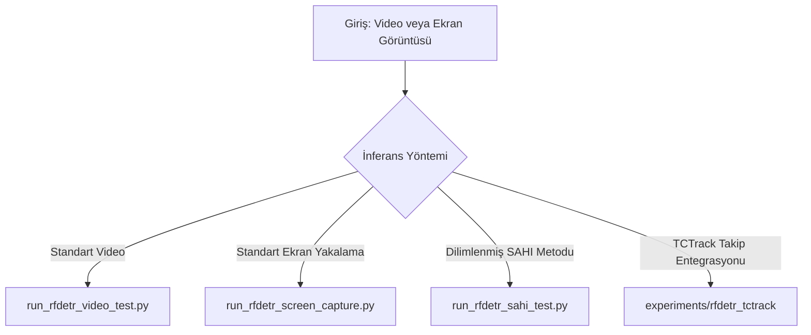

**RF-DETR** (Receptive Field-based DEtection TRansformer), gerçek zamanlı ve yüksek doğruluklu çalışan transformer tabanlı bir nesne tespit modelidir. Bu rehber, projedeki RF-DETR modelinin bağımlılıklarını, kurulumunu ve `experiments` klasöründeki test scriptlerinin kullanımını açıklamaktadır.

---

## 📦 1. Bağımlılıklar (Dependencies)

RF-DETR modelinin çalışabilmesi için python ortamında kurulması gereken kütüphaneler aşağıda kategorize edilmiştir.

### Çekirdek Bağımlılıklar (Core Dependencies)
Modelin yüklenmesi ve standart inferans yapabilmesi için gereklidir:
*   `torch >= 2.2.0` (GPU desteği için CUDA uyumlu sürüm önerilir)
*   `torchvision >= 0.14.0`
*   `tqdm` (İlerleme çubukları için)
*   `transformers < 6.0.0, >= 5.1.0` (Transformer modelleri için)
*   `peft` (Parametre verimli ince ayar için)
*   `pydantic` (Veri doğrulama için)
*   `supervision` (Roboflow görselleştirme ve analiz kütüphanesi)
*   `pyDeprecate`
*   `requests`

### Eğitim Ekstra Bağımlılıkları (`[train]`)
Modelin yeniden eğitilmesi (`experiments/training/rfdetr_training.ipynb`) için:
*   `pytorch_lightning >= 2.6, < 3`
*   `torchmetrics[detection] >= 1.2`
*   `faster-coco-eval >= 1.7.2`
*   `pycocotools`
*   `scipy`
*   `albumentations >= 1.4.24, < 3.0.0`
*   `roboflow`
*   `rf100vl`

### ONNX Dışa Aktarma Bağımlılıkları (`[onnx]`)
ONNX formatına dönüştürme için:
*   `onnx >= 1.16.0, < 1.20`
*   `onnxsim < 0.6.0` (ONNX Simplifier)
*   `onnx_graphsurgeon`
*   `onnxruntime`
*   `polygraphy`

### TensorRT Hızlandırma Bağımlılıkları (`[trt]`)
TensorRT `.engine` dosyası oluşturmak ve GPU üzerinde en yüksek performansı elde etmek için:
*   `pycuda`
*   `onnxruntime-gpu`
*   `tensorrt >= 8.6.1`
*   `polygraphy`

---

## 🚀 2. Kurulum ve Kurulum Adımları

Projeye ait virtual environment (`.venv`) aktifken aşağıdaki komutlarla kurulumları yapabilirsiniz:

```bash
# Sanal ortamı aktif edin
source .venv/bin/activate

# 1. Temel RF-DETR kurulumu
pip install rfdetr

# 2. Gerekli yan kütüphanelerin kurulumu
pip install supervision mss opencv-python numpy

# 3. ONNX ve TensorRT desteği için (opsiyonel)
pip install onnx onnxruntime tensorrt pycuda
```

> **Not:** Sisteminizde CUDA sürümü ve nvidia sürücülerinin kurulu olduğundan emin olun. PyTorch'un CUDA sürümüyle yüklendiğini doğrulamak için:
> ```bash
> python3 -c "import torch; print('CUDA Available:', torch.cuda.is_available())"
> ```

---

## 🧪 3. Projedeki Deney Scriptleri (Usage)

Tüm RF-DETR inferans kodları `experiments/rfdetr_inference/` klasöründe yer almaktadır.



### A. Standart Video Üzerinde Test
Bir video dosyasını okuyarak hedef tespiti gerçekleştirir ve çıktıyı kaydeder.

*   **Script:** `experiments/rfdetr_inference/run_rfdetr_video_test.py`
*   **Çalıştırma:**
    ```bash
    python experiments/rfdetr_inference/run_rfdetr_video_test.py
    ```
*   **Özellikler:** 
    *   `checkpoint_best_regular.pth` ağırlık dosyasını kullanır.
    *   Videodaki kareleri okur, `supervision` ile bounding box ve etiketleri çizer.
    *   Çıktıyı MP4/AVI formatında `outputs/` klasörüne kaydeder.

### B. Canlı Ekran Görüntüsü ile Tespit
Bilgisayar ekranını (simülasyon ekranı vb.) canlı olarak yakalayıp tespit yapar.

*   **Script:** `experiments/rfdetr_inference/run_rfdetr_screen_capture.py`
*   **Çalıştırma:**
    ```bash
    python experiments/rfdetr_inference/run_rfdetr_screen_capture.py
    ```
*   **Özellikler:**
    *   `mss` kütüphanesi ile belirtilen monitörü (`MONITOR_INDEX = 1`) anlık yakalar.
    *   `checkpoint_best_regular_celik_2.pth` ağırlık dosyasını kullanır.
    *   Ekran kaydı oluşturarak `/home/tom/Documents/DogFight/` altına kaydeder.

### C. SAHI (Slicing Aided Hyper Inference) ile Tespit
Küçük nesneleri tespit etmek için ekranı dilimlere ayırarak arama yapar ve sonuçları birleştirir.

*   **Script:** `experiments/rfdetr_inference/run_rfdetr_sahi_test.py`
*   **Çalıştırma:**
    ```bash
    python experiments/rfdetr_inference/run_rfdetr_sahi_test.py
    ```
*   **Özellikler:**
    *   Ekranı `640x640` piksel boyutlarında dilimlere böler (`OVERLAP_RATIO = 0.2`).
    *   Her dilim için modeli çalıştırır, koordinatları ana ekrana göre öteler.
    *   Çakışan kutuları önlemek için OpenCV sınıf bazlı NMS (`class_aware_nms`) algoritmasını kullanır.

---

## 🛠️ 4. ONNX ve TensorRT Model Dönüştürme (Export)

Çalışma zamanı performansını (FPS) artırmak için model ONNX veya TensorRT formatına dönüştürülebilir.

### ONNX Export
Model mimarisini `.onnx` dosyasına aktarır:
*   **Script:** `experiments/rfdetr_inference/export_rfdetr_onnx.py`
*   **Çalıştırma:**
    ```bash
    python experiments/rfdetr_inference/export_rfdetr_onnx.py
    ```

### TensorRT Export
Dışa aktarılan ONNX modelini doğrudan TensorRT Engine formatına derler:
*   **Script:** `experiments/rfdetr_inference/export_rfdetr_tensorrt.py`
*   **Çalıştırma:**
    ```bash
    python experiments/rfdetr_inference/export_rfdetr_tensorrt.py
    ```

---

## 🔗 5. RF-DETR + TCTrack Entegrasyonu

Görsel nesne tespiti ile temporal takibi birleştiren pipeline `experiments/rfdetr_tctrack/` altındadır. RF-DETR ile hedef ilk kez tespit edildikten sonra TCTrack algoritması hedefin kimliğini sonraki karelerde korur. Takip kalitesi düşerse RF-DETR otomatik olarak yeniden hedef tespiti yapar.

Detaylı çalıştırma komutları ve parametreler için [TCTrack Entegrasyon Klasörü](file:///home/tom/Documents/Projeler/DogFight/experiments/rfdetr_tctrack/README.md) dosyasını inceleyebilirsiniz.
