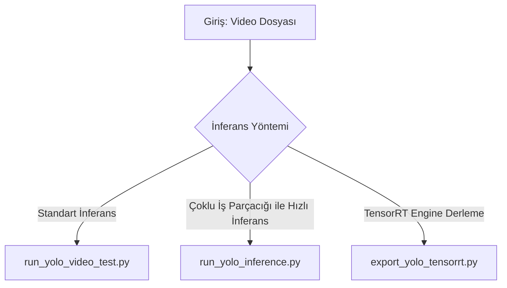

**YOLO** (You Only Look Once), yüksek hızlı ve gerçek zamanlı nesne tespiti için dünya genelinde en çok kullanılan bilgisayarlı görü modellerinden biridir. Projemizde hedef takip sisteminin görsel algılama kısmında alternatif olarak Ultralytics YOLOv8 ve YOLOv11 mimarileri desteklenmektedir. Bu rehber, projedeki YOLO modelinin bağımlılıklarını, kurulumunu ve `experiments` klasöründeki test scriptlerinin kullanımını açıklamaktadır.

---

## 📦 1. Bağımlılıklar (Dependencies)

YOLO modellerini çalıştırmak için gerekli Python kütüphaneleri aşağıda listelenmiştir.

### Çekirdek Bağımlılıklar (Core Dependencies)
Modelin yüklenmesi ve standart inferans yapabilmesi için gereklidir:
*   `ultralytics` (YOLOv8/v11 ana paketi)
*   `torch >= 1.8.0` (GPU/CUDA uyumlu olması önerilir)
*   `torchvision >= 0.9.0`
*   `numpy >= 1.23.0`
*   `opencv-python >= 4.6.0` (Görüntü okuma/yazma ve görselleştirme için)
*   `pillow >= 7.1.2`
*   `pyyaml >= 5.3.1`
*   `requests >= 2.23.0`
*   `scipy >= 1.4.1`
*   `psutil >= 5.8.0`
*   `polars >= 0.20.0`
*   `ultralytics-thop >= 2.0.18` (FLOP hesaplama için)

### Dışa Aktarma Bağımlılıkları (`[export]`)
Modeli TensorRT, ONNX veya OpenVINO formatlarına dönüştürmek için:
*   `onnx >= 1.12.0`
*   `onnxslim >= 0.1.82` (ONNX Simplifier)
*   `tensorrt` (NVIDIA GPU üzerinde TensorRT Engine formatı için)

---

## 🚀 2. Kurulum ve Kurulum Adımları

Sanal ortamı (`.venv`) aktif ederek aşağıdaki komutlar vasıtasıyla kurulumları yapabilirsiniz:

```bash
# Sanal ortamı aktif edin
source .venv/bin/activate

# 1. Ultralytics (YOLO) paketinin kurulması
pip install ultralytics

# 2. CUDA destekli PyTorch kurulu değilse (GPU kullanımı için)
# Kendi CUDA sürümünüze uygun olarak kurun. Örnek CUDA 11.8 için:
pip install torch torchvision --index-url https://download.pytorch.org/whl/cu118

# 3. Diğer yardımcı kütüphaneler
pip install opencv-python numpy matplotlib
```

---

## 🧪 3. Projedeki Deney Scriptleri (Usage)

Tüm YOLO inferans ve dışa aktarım kodları `experiments/yolo_inference/` klasöründe yer almaktadır.



### A. Standart Video Üzerinde Test
Bir video dosyasını okuyarak hedef tespiti yapar ve çıktıyı kaydeder.

*   **Script:** `experiments/yolo_inference/run_yolo_video_test.py`
*   **Çalıştırma:**
    ```bash
    python experiments/yolo_inference/run_yolo_video_test.py
    ```
*   **Özellikler:** 
    *   `/home/tom/Downloads/epoch40.pt` ağırlık dosyasını varsayılan olarak kullanır.
    *   OpenCV üzerinden `/home/tom/Downloads/istockphoto-2179703365-640_adpp_is.mp4` videosunu işler.
    *   Algılanan hedeflere ait sınıfları ve güven skorlarını çizerek `output_video.mp4` adıyla kaydeder.

### B. Çoklu İş Parçacıklı (Multi-threaded) Gerçek Zamanlı İnferans
Giriş karesi okuma, yapay zeka tespiti ve ekran çizim işlemlerini eşzamanlı yürüterek FPS değerini maksimize eder.

*   **Script:** `experiments/yolo_inference/run_yolo_inference.py`
*   **Çalıştırma:**
    ```bash
    python experiments/yolo_inference/run_yolo_inference.py
    ```
*   **Özellikler:**
    *   `model.pt` dosyasını CUDA/CPU üzerinde çalıştırır.
    *   Bir arka plan iş parçacığı (`threading.Thread`) arka arkaya gelen kareleri (`deque` buffer üzerinden) asenkron işler.
    *   Kareleri işleme sokmadan önce yeniden boyutlandırır (`scale_factor = 0.4`), tespiti yaptıktan sonra kutu koordinatlarını tekrar orijinal ölçeğe dönüştürür.
    *   Ekranda anlık (Current FPS), ortalama (Avg FPS), minimum (Min FPS) ve maksimum (Max FPS) değerlerini çizdirir.

---

## 🛠️ 4. TensorRT Model Dönüştürme (Export)

YOLO modellerini GPU üzerinde en yüksek performansta ve en düşük gecikmeyle (latency) çalıştırmak için TensorRT Engine formatına (`.engine`) dönüştürebilirsiniz.

*   **Script:** `experiments/yolo_inference/export_yolo_tensorrt.py`
*   **Çalıştırma:**
    ```bash
    python experiments/yolo_inference/export_yolo_tensorrt.py
    ```
*   **Açıklama:**
    *   Script, `epoch40.pt` ağırlık dosyasını okuyarak `format="engine"` parametresiyle TensorRT Engine dosyasına dönüştürür.
    *   Hassasiyet optimizasyonu için FP16 precision modunu (`half=True`) ve ONNX sadeleştiriciyi (`simplify=True`) kullanır.
    *   Dönüştürme bittikten sonra dummy `640x640` siyah bir görsel oluşturarak oluşturulan `model.engine` dosyasını test eder.

### Olası TensorRT Dönüştürme Hataları ve Çözümleri:
1.  **TensorRT Versiyon Uyuşmazlığı:** `pip install tensorrt==8.6.1` komutu ile projenizle uyumlu kararlı sürümü kurun.
2.  **CUDA Versiyon Kontrolü:** `nvidia-smi` komutu ile ekran kartınızın CUDA sürücüsünün `11.8+` olduğundan emin olun.
3.  **Kütüphanelerin Kurulumu:** PyTorch sürümünüzün `2.0+` olduğundan emin olun.
